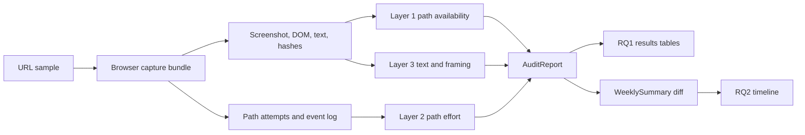

# SSRP 2026 Figure Plan, 2026-06-06

## Evidence Snapshot

- Evidence window: Week 2
- Target sites: 5
- RQ1 figure data available: 5/5
- RQ2 timeline data available: 5/5
- Cycle capture status: `completed`

## Figure Readiness

| Figure | Paper use | Status | Source/candidate | Next action |
|---|---|---|---|---|
| System architecture | Methods | Ready now | CONCEPTS.md; capture/report pipeline | Convert Mermaid draft to final figure. |
| Three-layer rubric | Methods | Ready now | CONCEPTS.md; SCHEMA.md | Convert rubric language into a compact table. |
| Results distribution | RQ1 findings | Ready after sanity review | docs/research/ssrp_results_tables_2026-06-06.md | Use with current sanity check; refresh after future captures. |
| Evidence card example | Methods/Findings | Ready after sanity review | The Guardian; data/captures/sites/www_theguardian_com_20260605_160209/layer1.png; data/captures/sites/www_theguardian_com_20260605_160209/layer1.html | Verify selected references and build a paper evidence card. |
| Longitudinal change timeline | RQ2 findings | Ready after sanity review | Coca-Cola; The Guardian; CNN | Choose 2-3 sites for the RQ2 timeline figure. |
| Poster workflow panel | Poster/demo | Ready now | paper skeleton; figure plan | Reuse architecture and evidence-card panels. |

## Architecture Diagram Draft

## Timeline Candidates

| Site | Category | Severity | Event count | Event types | Implication |
|---|---|---|---|---|---|
| Coca-Cola | food | D | 5 | copy_change+dom_restructure+layout_change+pathway_change+score_change | User-visible consent choices or audit tier changed; inspect evidence before paper coding. |
| The Guardian | news | D | 4 | copy_change+dom_restructure+layout_change+pathway_change | User-visible consent choices or audit tier changed; inspect evidence before paper coding. |
| CNN | news | C | 3 | copy_change+dom_restructure+layout_change | Interface structure or layout changed; review screenshots before comparing scores. |
| Booking.com | travel | C | 3 | copy_change+dom_restructure+layout_change | Interface structure or layout changed; review screenshots before comparing scores. |
| NerdWallet | finance | C | 3 | copy_change+dom_restructure+layout_change | Interface structure or layout changed; review screenshots before comparing scores. |

## Source Artifacts

- Targets: `data/week2_deep_sample_targets_2026-06-06.csv`
- RQ1 audit reports: `data/research_package/audit_report_summary.csv`
- RQ2 longitudinal summaries: `data/research_package/longitudinal_summary.csv`
- Results tables: `docs/research/ssrp_results_tables_2026-06-06.md`
- Paper skeleton: `docs/research/ssrp_paper_skeleton_2026-06-06.md`
- Cycle report: `docs/research/week2_cycle_report_2026-06-06.md`
